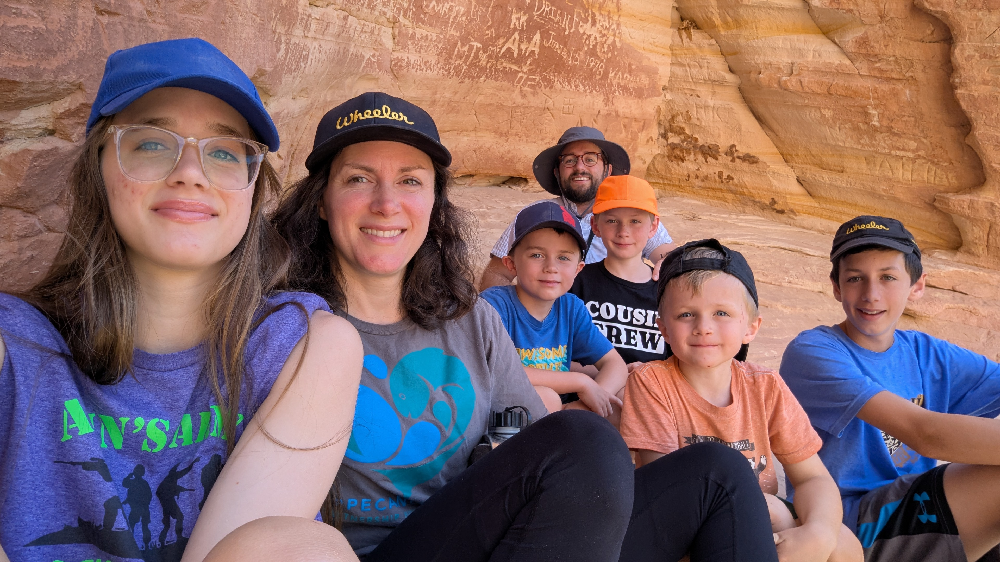
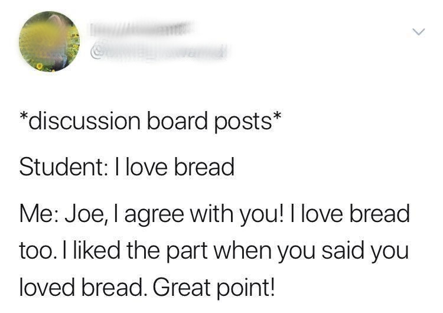

# Welcome to COM 324: Organizational Communication!

## About me

## Dad Joke

Why did the manager get promoted?

She really knew how to work through the channels.

## Introductions

- Name
- Year / Major
- An organization you're currently part of (team, job, club, family business, etc.)

## What is organizational communication?

- We spend most of our lives *in* organizations
  - Schools, workplaces, families, teams, clubs, governments
- Communication is how organizations *exist*
  - Not just what happens inside them — it's what *makes* them

## This course

We'll look at:

- How communication *creates* organizational culture
- How power and identity operate in workplaces
- How conflict, decision-making, and emotion are fundamentally communicative
- How organizations interact with their broader environments

## Goals

1. Understand the major theoretical traditions in organizational communication
2. Critically analyze communication in organizational contexts
3. Apply concepts to real-world situations in your own life
4. Engage thoughtfully with scholarly perspectives

# How we get there

## Class format

**Tuesdays** — Discussion-centric

- You've done the reading; we go deeper
- Driven by your questions and 3-2-1s
- Cold calling (friendly — it's about learning, not gotcha)

**Thursdays** — Workshop

- Apply concepts to case studies in groups
- Project work, peer feedback, exams

## Grading

- Normal grading has some unintended consequences

- How can we build a community where the goal is actually learning?

## Self-assessment grading

- I'm interested in teaching, not assessing
- At three points this semester you'll reflect on your work and propose a grade
  - Oct 1 · Nov 19 · Dec 10
- I'll provide feedback; if I disagree I'll reach out
- Exams are graded normally (they're 30% of the grade)

## Assignments

**3-2-1 Reading Reviews** (before most Tuesdays)

- 3 concepts / connections
- 2 questions / confusions
- 1 discussion question → post to Discord #discussions

**OR: AI Conversation** — have a dialogue with AI about the reading, share the link + a reflection

## More assignments

- **In-class case studies** (most Thursdays) — group work, no outside prep needed
- **Theory Application Short Paper** (~2 pp) — due Oct 22
- **Organizational Profile memo** (~1–2 pp) — due Nov 12
- **Final Project** — 4–5 pp analysis + 5–7 min presentation — due Dec 10
- **2 in-class exams** — Oct 8 and Dec 1

## Resources

**Discord** — primary place for questions and announcements

**Course website** — syllabus, schedule, slides, assignment details

**Brightspace** — submit assignments; some readings

**Office hours** — Tuesdays 1–3 PM, BRNG 2134 (or by appointment)

## AI Policy

AI is a powerful tool. I want you to use it well, not avoid it.

- ✅ Use AI to understand concepts and readings
- ✅ Use AI for feedback on your writing
- ✅ Use AI as a conversation partner (it's literally an assignment option)
- ❌ Don't use AI to write your assignments for you

The principle: **scaffold, not shortcut**

## Thursday

Two activities — bring a pen:

1. **Gallery walk**: Is it an organization?
2. **Org mapping**: mapping your own organizational life

The org you think of today may become your final project.

## Before Thursday

- Read the full syllabus
- Complete the Initial Self-Assessment on Brightspace
- Make sure you're on Discord

## Questions?
