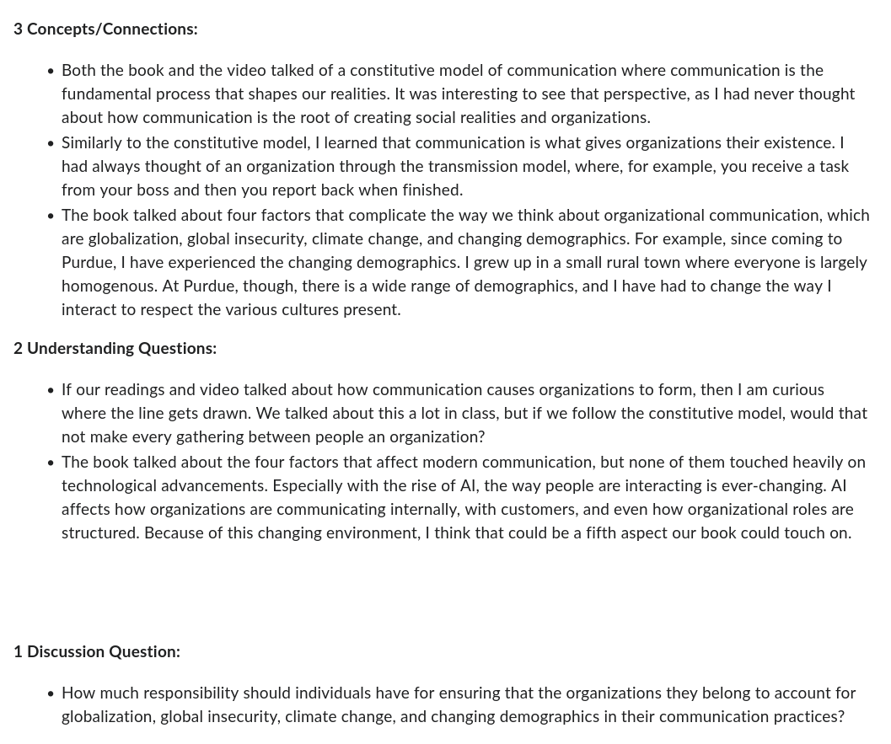

## Today's Dad Joke

I wanted to marry a Carbon 14 expert but all she wanted to do was date.

## Housekeeping

> - Intro survey
> - Discussion questions
> - Homework 1
>	- All were due Monday at 1 pm

## 3-2-1 Example

## The Plan

> - Housekeeping / Announcements (5-10)
> - Discussion and review (40-50)
> - Consolidation and Confusion (5-10)
>	- Response to needs

## Review

> - Conceptual review every Tuesday
>	- Encouragement to be prepared
>	- Time to identify confusion - it's OK to be confused!
> - Discussion questions review

# Homework and Reading Review

## Class Questions

> - What do you want to talk about today?

## Basic Concepts

> - What is communication?
> - What is the transmission model of communication?
> - What is requisite variety?
> - Why are organizations more complicated now?
> - What are some of the forces of change that are affecting organizations?

## Questions from 3-2-1s

> - Isn't Craig's "constitutive model" just a subset of the Rhetorical Domain? To me, it seems like the "practical art of discourse" is a superset of "producing shared meaning".
> - If "communication constitutes organizations" does that mean every gathering of people is an organization?
> - Can informal communication such as workplace gossip influence an organization as much as formal communication such as meetings or emails?

## Questions from 3-2-1s

> - How does communication play a role in helping organizations address larger social and global issues, such as climate change?
> - What is a "majority minority" nation?

## Discussion Questions

> - What role do individuals have in addressing larger social and global issues, such as climate change, within organizations?
> - How is technology changing organizations?

## Consolidation

> - What were some of the key ideas?
> - What are you thinking differently about now?
> - What are remaining questions/confusions?

## Thursday

> - Case studies